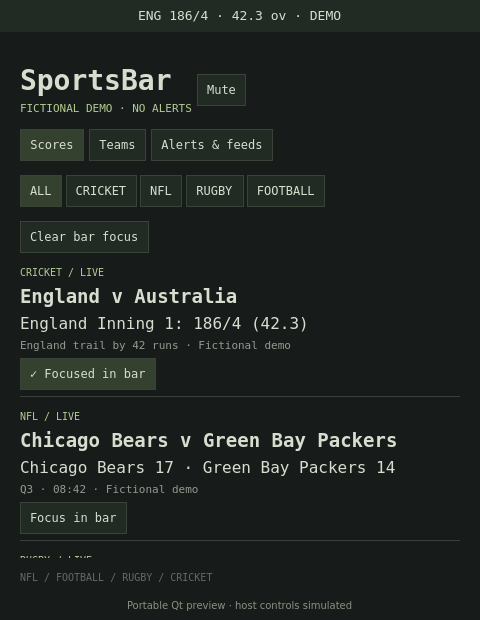

# SportsBar

<p>
<a href="LICENSE"></a>
<a href="https://github.com/tcballard/omarchy-badges"></a>
</p>

Follow your teams from the Omarchy bar. See scores and get desktop notifications when a score changes or a wicket falls, without keeping a sports website open.

**First development preview.** Portable tests pass; live Omarchy integration and authenticated cricket/rugby feeds are not yet verified. This is not a published marketplace release.



## What works in this preview

- NFL, football, rugby and cricket feed adapters, sharing one background service across monitors.
- Search teams in current fixtures, follow/unfollow them, or enter an exact team name. Names are scoped by sport and saved in the widget's inline `shell.json` settings.
- Compact popout and horizontal/vertical bar display. Choose **Focus in bar** on a match to pin its score, e.g. `ENG 186/4 · 42.3 ov` or `ARS 2 – LIV 1`. Focus is saved; changing it leaves all other followed-team alerts running. Final results stay pinned while present in the feed. Missing focused events show unavailable rather than silently switching matches. **Clear bar focus** restores the first-live-match display.
- Per-feed errors and retained stale scores.
- Optional score, wicket, match-start and match-finish notifications. Both sides of a followed match count: get wickets whether your team is batting or bowling.
- Session mute, individual alert switches, provider switches and football competition selection.
- Fictional demo mode: no network requests or notifications.

Score changes are described as **score updates**, not inferred touchdowns, tries or individual goals. Multiple wickets between polls produce one aggregate notification. The first observation, a new innings, restart, settings change or recovery after an error establishes a baseline without historical alerts. Corrected scores that return to an already observed high watermark do not alert again; this favours avoiding duplicates over notifying every reversal. Cricket runs alone do not alert.

## Feeds and limits

| Sport | Adapter | Setup | Polling |
| --- | --- | --- | --- |
| NFL | ESPN public website scoreboard | No key | 60 seconds |
| Football | ESPN public website scoreboard | No key; choose one competition | 60 seconds |
| Rugby | API-Sports Rugby games for today's UTC date | `SPORTSBAR_RUGBY_KEY` | 20 minutes, or 60 seconds in fast mode |
| Cricket | CricketData `currentMatches`, up to 100 matches | `SPORTSBAR_CRICKET_KEY` | 20 minutes, or 60 seconds in fast mode |

Alerts arrive **after the provider updates and the next successful poll**. These are not push feeds or guaranteed instant alerts. Standard cricket/rugby mode can lag by 20 minutes; choose fast mode with an appropriate plan for useful in-play alerts. Fast mode consumes up to 60 rugby requests per hour and up to 240 cricket requests per hour (four pages). Standard mode is not a daily quota guarantee: cricket can use multiple pages and restarts can add requests. HTTP errors back off to a maximum of one hour; refresh IPC respects the current deadline.

ESPN endpoints are undocumented website interfaces without an API availability commitment. NFL and Premier League endpoints were inspected publicly during development; the adapters have fixture tests. CricketData and API-Sports require your own account and coverage/quota checks. No paid provider key was available for a real response or latency test. Missing credentials are shown as authentication-required, not empty match lists. No BBC scraping is used.

The initial scope is current scoreboards, not every competition, historic results, standings or a complete searchable team directory. Football fetches one selected competition at a time (default Premier League); teams playing outside it will not appear. Rugby coverage depends on the API-Sports plan. Cricket follows exact provider team names. Additional provider adapters can reuse the normalized match contract and alert engine.

Sources checked 14 September 2026:

- [ESPN NFL scoreboard](https://site.api.espn.com/apis/site/v2/sports/football/nfl/scoreboard)
- [ESPN Premier League scoreboard](https://site.api.espn.com/apis/site/v2/sports/soccer/eng.1/scoreboard)
- [API-Sports Rugby documentation](https://api-sports.io/documentation/rugby/v1)
- [CricketData current-matches guide](https://cricketdata.org/live-cricket-score-api/)
- [CricketData score fields](https://cricketdata.org/cricket-live-score-api/)

## Build and install for testing

Requires Omarchy's Quattro shell, Rust/Cargo to build the helper, `libnotify` (`notify-send`) and coreutils (`/usr/bin/timeout`). The helper uses HTTPS through rustls and does not need Python or Node at runtime. No install hooks run when adding the plugin.

Clone the repository and enter its directory:

```bash
git clone https://github.com/tcballard/omarchy-sportsbar.git
cd omarchy-sportsbar
```

Build and install the helper explicitly:

```bash
CARGO_TARGET_DIR="${XDG_CACHE_HOME:-$HOME/.cache}/sportsbar-build" cargo install --path . --locked
```

Ensure `sportsbar-feed` is on the **Omarchy shell process's PATH**, not only your terminal's PATH. Test it in a terminal:

```bash
sportsbar-feed --demo
sportsbar-feed nfl
```

Install the plugin from its repository:

```bash
omarchy plugin add https://github.com/tcballard/omarchy-sportsbar --yes
omarchy plugin enable io.github.tcballard.sportsbar --yes
```

The display name is **SportsBar**; the repository is **omarchy-sportsbar**. This first published preview uses plugin ID `io.github.tcballard.sportsbar`, helper `sportsbar-feed` and the `SPORTSBAR_*` environment variables below. If you manually installed the earlier unpublished OmaSports preview, remove `io.github.tcballard.omasports` and its `omasports-feed` helper before enabling this one. Transfer any favourite settings you want to keep.

Click **Sports → Teams**, select a sport and follow your teams. In **Alerts & feeds**, choose a football competition, alert categories and polling speed. For a safe visual trial, enable **Fictional demo** there first. This does not set your favourites to the fictional teams.

Left click opens the panel; right click mutes/unmutes notifications for the session. Tab/Shift+Tab move between controls; Enter/Space activate buttons; Escape closes the panel.

## Cricket and rugby credentials

Create accounts with [CricketData](https://cricketdata.org/) and [API-Sports](https://api-sports.io/). Supply `SPORTSBAR_CRICKET_KEY` and `SPORTSBAR_RUGBY_KEY` through your login/session environment so the running `omarchy-shell` and its child helper inherit them. Re-login after changing the session environment. Exporting them only in a terminal will not update an already running shell.

Do not put keys in `shell.json`, the repository, screenshots or issues. Only the Rust helper reads these two environment variables. It never emits them in output; network failures have fixed messages without request URLs. Credentials go directly over HTTPS to the chosen provider. Keys are not entered or displayed in the panel.

## Compatibility

Targets the installed Omarchy Quattro shell's hosted `service` + `bar-widget` contract. Installed system versions are reported by `omarchy-version`; ISO and Quickshell engine versions are separate. **No installed Omarchy version has been tested yet**, so no compatibility-range badge is claimed. An ordinary third-party replacement bar can lack access to the widget's service; use Omarchy's built-in bar for the initial test.

## Development and evidence

```bash
./tests/run
# Optional Qt component/lifecycle checks (requires PySide6):
python3 tests/qml_smoke.py --screenshot
```

The Qt test uses explicit doubles for Omarchy/Quickshell host components. It renders the actual `SportsContent.qml` and exercises actual service methods, but does not validate real layer-shell focus, process launch, D-Bus notifications, service injection or theme switching. See [verification](docs/VERIFICATION.md) for the remaining live checks and [design](docs/DESIGN.md) for state ownership and dependencies.

This project was scaffolded with the local **Build Omarchy Plugins v0.4.0 release candidate**, commit `66d894eca17b0eb863bbae5926a9b122fa5a803d`. The remote `v0.4.0` tag was not available when this build began. Applied bundle skills: design, scaffold, bar-widget, service-ipc, QML patterns and test. No bundle files were modified.

Suggested repository topics: `omarchy`, `omarchy-plugin`, `sports`, `cricket`, `live-scores`.

## Removal

Disable/remove the plugin with `omarchy plugin remove io.github.tcballard.sportsbar`. The helper is separately owned: remove it with `cargo uninstall sportsbar-feed` if no longer needed. Remove provider environment variables from your session configuration yourself. Match history is session-only; the plugin creates no separate credential or cache files. Omarchy owns the widget settings.

MIT licensed. Data providers retain their own data rights and terms.
